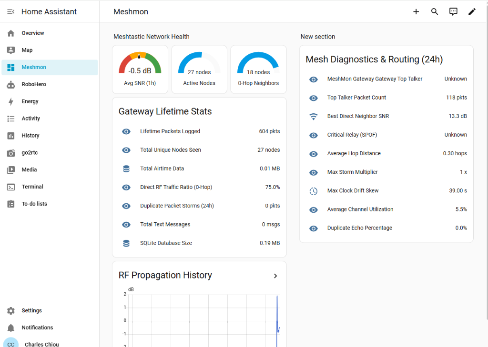

# Home Assistant Integration Guide for MeshMon

`meshmon` seamlessly integrates with Home Assistant using **MQTT Auto-Discovery**. Both individual node telemetry (environmental sensors, power, battery) and gateway-level mesh network health metrics (active node counts, average SNR, direct neighbors, duplicate packet storm counts, and database storage) are automatically populated into Home Assistant without requiring manual YAML entity definitions.

---

## 1. Architecture Overview

```
                      ┌──────────────────────┐
                      │  Meshtastic Radios   │
                      └──────────┬───────────┘
                                 │ LoRa RF Packets
                                 ▼
                      ┌──────────────────────┐
                      │       MeshMon        │
                      │  (SQLite DB Engine)  │
                      └──────────┬───────────┘
                                 │ MQTT Auto-Discovery + Telemetry State
                                 ▼
                      ┌──────────────────────┐
                      │   Mosquitto Broker   │
                      └──────────┬───────────┘
                                 │
                                 ▼
                      ┌──────────────────────┐
                      │    Home Assistant    │
                      │  (Lovelace Dashboard)│
                      └──────────────────────┘
```

When `meshmon` receives telemetry from authorized nodes or computes aggregate mesh health from its SQLite database, it publishes:
1. **MQTT Discovery Configs (`homeassistant/sensor/.../config`)**: Broadcast with `retain=true` to automatically register devices and sensor entities.
2. **State Updates (`meshmon/...`)**: Real-time measurement values and attributes.

---

## 2. Step-by-Step Setup Guide

### Step 1: Install & Configure Mosquitto Broker in Home Assistant
1. In Home Assistant, navigate to **Settings $\rightarrow$ Add-ons $\rightarrow$ Add-on Store**.
2. Search for **Mosquitto broker** and click **Install**.
3. Once installed, start the add-on and toggle **Start on boot** and **Watchdog**.
4. (Optional) Create a dedicated MQTT user in Home Assistant under **Settings $\rightarrow$ People $\rightarrow$ Users** (e.g. username `meshmon`, password `<secure-password>`).

### Step 2: Configure MQTT Integration in Home Assistant
1. Go to **Settings $\rightarrow$ Devices & Services**.
2. If discovered automatically, click **Configure** on the MQTT integration. Otherwise, click **Add Integration**, search for **MQTT**, and enter your broker details (`core-mosquitto` or Home Assistant IP address, port `1883`, username, and password).
3. Ensure **Enable discovery** is checked (enabled by default).

### Step 3: Configure `meshmon` to Publish to MQTT
Edit your `~/.meshmon` configuration file to enable the `mqtt` block:

```text
mqtt = {
    server = "192.168.1.100";  // Home Assistant or Mosquitto broker IP
    port = 1883;
    user = "meshmon";
    password = "your-mqtt-password";
    topic = "meshmon";
    tls = false;
};

database = {
    enabled = true;
    path = "~/.meshmon.db";
    retention_days = 90;
};
```

Restart `meshmon`. Within seconds, Home Assistant will discover the gateway and all authorized mesh nodes!

---

## 3. Exported Entities & Topics Catalog

### A. MeshMon Gateway Health & Physics (`meshmon_gateway`)

| Shell Command | Sensor Entity Name | Unique ID | Registered Entity ID | State Topic | Unit | Device Class |
| :--- | :--- | :--- | :--- | :--- | :---: | :---: |
| **db summary** | **Total Packets** | `meshmon_gateway_packets` | `sensor.meshmon_gateway_gateway_total_packets` | `meshmon/gateway/total_packets` | pkts | — |
| **db summary** | **Total Nodes Seen** | `meshmon_gateway_total_nodes` | `sensor.meshmon_gateway_gateway_total_nodes` | `meshmon/gateway/total_nodes` | nodes | — |
| **db summary** | **Total Airtime Data** | `meshmon_gateway_total_bytes` | `sensor.meshmon_gateway_gateway_total_airtime_data` | `meshmon/gateway/total_bytes_mb` | MB | `data_size` |
| **db summary** | **Direct Ratio** | `meshmon_gateway_direct_ratio` | `sensor.meshmon_gateway_gateway_direct_ratio` | `meshmon/gateway/direct_ratio_pct` | % | — |
| **db summary** | **Broadcast Ratio** | `meshmon_gateway_broadcast_ratio` | `sensor.meshmon_gateway_gateway_broadcast_ratio` | `meshmon/gateway/broadcast_ratio_pct` | % | — |
| **db summary** | **Average Hops** | `meshmon_gateway_avg_hops` | `sensor.meshmon_gateway_gateway_average_hops` | `meshmon/gateway/avg_hops` | hops | — |
| **db summary** | **Total Messages** | `meshmon_gateway_total_messages` | `sensor.meshmon_gateway_gateway_total_messages` | `meshmon/gateway/total_messages` | msgs | — |
| **db summary** | **Active Nodes (24h)** | `meshmon_gateway_active_nodes` | `sensor.meshmon_gateway_gateway_active_nodes_24h` | `meshmon/gateway/active_nodes_24h` | nodes | — |
| **db summary** | **DB Size** | `meshmon_gateway_db_size` | `sensor.meshmon_gateway_gateway_db_size` | `meshmon/gateway/db_size_mb` | MB | `data_size` |
| **db neighbors** | **Average SNR (1h)** | `meshmon_gateway_avg_snr` | `sensor.meshmon_gateway_gateway_average_snr_1h` | `meshmon/gateway/avg_snr_1h` | dB | `signal_strength` |
| **db neighbors** | **Direct Neighbors** | `meshmon_gateway_direct_neighbors` | `sensor.meshmon_gateway_gateway_direct_neighbors` | `meshmon/gateway/direct_neighbors` | nodes | — |
| **db neighbors** | **Best Neighbor SNR** | `meshmon_gateway_best_neighbor_snr` | `sensor.meshmon_gateway_gateway_best_neighbor_snr` | `meshmon/gateway/best_neighbor_snr` | dB | `signal_strength` |
| **db toptalkers**| **Top Talker** | `meshmon_gateway_top_talker` | `sensor.meshmon_gateway_gateway_top_talker` | `meshmon/gateway/top_talker` | — | — |
| **db toptalkers**| **Top Talker Packets**| `meshmon_gateway_top_talker_packets`| `sensor.meshmon_gateway_gateway_top_talker_packets` | `meshmon/gateway/top_talker_packets`| pkts | — |
| **db storm** | **Duplicate Packets (24h)**| `meshmon_gateway_duplicate_packets` | `sensor.meshmon_gateway_gateway_duplicate_packets` | `meshmon/gateway/duplicate_packets` | pkts | — |
| **db storm** | **Max Echo Multiplier**| `meshmon_gateway_max_echo_mult` | `sensor.meshmon_gateway_gateway_max_echo_multiplier` | `meshmon/gateway/max_echo_mult` | x | — |
| **db spof** | **Critical Relay** | `meshmon_gateway_critical_relay` | `sensor.meshmon_gateway_gateway_critical_relay` | `meshmon/gateway/critical_relay` | — | — |
| **db drift** | **Max Clock Drift** | `meshmon_gateway_max_clock_drift` | `sensor.meshmon_gateway_gateway_max_clock_drift` | `meshmon/gateway/max_clock_drift_sec` | s | `duration` |
| **db health** | **Avg Channel Util** | `meshmon_gateway_avg_channel_util` | `sensor.meshmon_gateway_gateway_avg_channel_util` | `meshmon/gateway/avg_channel_util` | % | — |
| **db health** | **Duplicate Ratio** | `meshmon_gateway_duplicate_ratio` | `sensor.meshmon_gateway_gateway_duplicate_ratio` | `meshmon/gateway/duplicate_ratio_pct` | % | — |

---

### B. Per-Node Environmental & Device Sensors (`meshmon_<node_id>_*`)

| Sensor Type | State Topic | Unit | Device Class |
| :--- | :--- | :---: | :---: |
| **Temperature** | `meshmon/<node_id>/temperature` | °C | `temperature` |
| **Relative Humidity** | `meshmon/<node_id>/humidity` | % | `humidity` |
| **Barometric Pressure** | `meshmon/<node_id>/pressure` | hPa | `pressure` |
| **Battery Level** | `meshmon/<node_id>/battery` | % | `battery` |
| **Battery Voltage** | `meshmon/<node_id>/voltage` | V | `voltage` |
| **Channel Utilization** | `meshmon/<node_id>/channel_utilization` | % | — |
| **Air Util (Tx)** | `meshmon/<node_id>/air_util_tx` | % | — |
| **Channel 1 Voltage / Current** | `meshmon/<node_id>/ch1_voltage`, `_current` | V / mA | `voltage` / `current` |
| **Channel 2 Voltage / Current** | `meshmon/<node_id>/ch2_voltage`, `_current` | V / mA | `voltage` / `current` |
| **Channel 3 Voltage / Current** | `meshmon/<node_id>/ch3_voltage`, `_current` | V / mA | `voltage` / `current` |

---

## 4. Live Lovelace Dashboard Preview

<p align="center">
  
</p>

---

## 5. Sample Lovelace Dashboard Cards (YAML)

Add these custom cards to your Home Assistant dashboard for real-time mesh monitoring.

### Card 1: Gateway Overview & Mesh Health Gauges
```yaml
type: vertical-stack
cards:
  - type: heading
    heading: Meshtastic Network Health
  - type: grid
    columns: 3
    square: false
    cards:
      - type: gauge
        entity: sensor.meshmon_gateway_gateway_average_snr_1h
        min: -15
        max: 15
        name: Avg SNR (1h)
        needle: true
        severity:
          green: 3
          yellow: -5
          red: -15
      - type: gauge
        entity: sensor.meshmon_gateway_gateway_active_nodes_24h
        min: 0
        max: 50
        name: Active Nodes
      - type: gauge
        entity: sensor.meshmon_gateway_gateway_direct_neighbors
        min: 0
        max: 20
        name: 0-Hop Neighbors
  - type: entities
    title: Gateway Lifetime Stats
    entities:
      - entity: sensor.meshmon_gateway_gateway_total_packets
        name: Lifetime Packets Logged
      - entity: sensor.meshmon_gateway_gateway_total_nodes
        name: Total Unique Nodes Seen
      - entity: sensor.meshmon_gateway_gateway_total_airtime_data
        name: Total Airtime Data
      - entity: sensor.meshmon_gateway_gateway_direct_ratio
        name: Direct RF Traffic Ratio (0-Hop)
      - entity: sensor.meshmon_gateway_gateway_duplicate_packets
        name: Duplicate Packet Storms (24h)
      - entity: sensor.meshmon_gateway_gateway_total_messages
        name: Total Text Messages
      - entity: sensor.meshmon_gateway_gateway_db_size
        name: SQLite Database Size
```

---

### Card 2: Mesh Diagnostics & Topology Status
```yaml
type: entities
title: Mesh Diagnostics & Routing (24h)
entities:
  - entity: sensor.meshmon_gateway_gateway_top_talker
    name: #1 Top Talker Node
  - entity: sensor.meshmon_gateway_gateway_top_talker_packets
    name: Top Talker Packet Count
  - entity: sensor.meshmon_gateway_gateway_best_neighbor_snr
    name: Best Direct Neighbor SNR
  - entity: sensor.meshmon_gateway_gateway_critical_relay
    name: Critical Relay (SPOF)
  - entity: sensor.meshmon_gateway_gateway_average_hops
    name: Average Hop Distance
  - entity: sensor.meshmon_gateway_gateway_max_echo_multiplier
    name: Max Storm Multiplier
  - entity: sensor.meshmon_gateway_gateway_max_clock_drift
    name: Max Clock Drift Skew
  - entity: sensor.meshmon_gateway_gateway_avg_channel_util
    name: Average Channel Utilization
  - entity: sensor.meshmon_gateway_gateway_duplicate_ratio
    name: Duplicate Echo Percentage
```

---

### Card 3: Environmental & Power Telemetry Grid
*(Replace example entity IDs with your discovered station names or node hex IDs)*
```yaml
type: vertical-stack
cards:
  - type: heading
    heading: Remote Station Telemetry
  - type: grid
    columns: 2
    square: false
    cards:
      - type: sensor
        entity: sensor.station_alpha_temperature
        name: Station Temperature
        graph: line
      - type: sensor
        entity: sensor.station_alpha_humidity
        name: Station Humidity
        graph: line
      - type: sensor
        entity: sensor.repeater_roof_battery
        name: Repeater Battery %
        graph: line
      - type: sensor
        entity: sensor.repeater_roof_voltage
        name: Repeater Voltage
        graph: line
```

---

### Card 4: RF Link Quality & Signal History
```yaml
type: history-graph
title: RF Propagation History
hours_to_show: 48
entities:
  - entity: sensor.meshmon_gateway_gateway_average_snr_1h
    name: Gateway Average SNR (dB)
```
